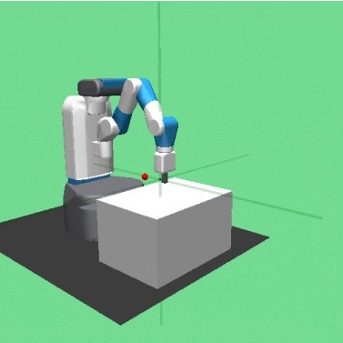

# Optimal Transport Policy Fusion

This repository contains Google Colab notebooks to easily run each of the four experiments discussed in the paper ["Renaissance Robot: Optimal Transport Policy Fusion for Learning Diverse Skills"](https://arxiv.org/abs/2207.00978).

## The Experiments

Each of the four experiments use OpenAI Gym environments.

The Reacher, Walker2d and Half-Cheetah experiments use the PyBullet engine:

  
   
  

The Fetch Reach experiment uses the Mujoco engine:

  

